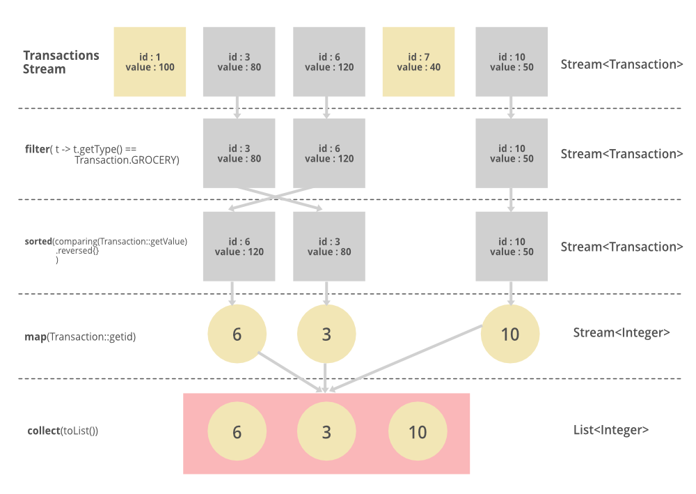

# 아이템 45. 스트림은 주의해서 사용하라

---

### ✅ 스트림(Stream)

> **스트림이란?**
>
- 데이터의 흐름

자바 8 이전에는 배열 또는 컬렉션 인스턴스를 다루는 방법은 for 또는 foreach 문을 돌면서 요소 하나씩을 꺼내서 다루는 방법이었다.

간단한 경우라면 상관없지만 로직이 복잡해질수록 코드의 양이 많아져 여러 로직이 섞이게 되고, 메소드를 나눌 경우 루프를 여러 번 도는 경우가 발생한다.

스트림을 사용하면 배열 또는 컬렉션 인스턴스에 **함수 여러 개를 조합해서 원하는 결과를 필터링하고 가공된 결과**를 얻을 수 있다.

또한 **람다를 이용해서 코드의 양을 줄이고 간결하게 표현**할 수 있다.

즉, 배열과 컬렉션을 함수형으로 처리할 수 있게 한다.

또 하나의 장점은 간단하게 **병렬처리**가 가능하다는 것이다. 하나의 작업을 둘 이상의 작업으로 잘게 나눠서 동시에 진행하는 것을 병럴 처리라고 한다.

즉 스레드를 이용해 많은 요소들을 빠르게 처리할 수 있다.

> **스트림 사용**
>
1. **생성하기** : 스트림 인스턴스 생성
2. **가공하기** : 필터링 및 맵핑 등 원하는 결과를 만들어가는 중간 작업(intermediate opertations)
3. **결과 만들기** : 최종적으로 원하는 결과를 만들어내는 작업

[Java 스트림 Stream (1) 총정리](https://futurecreator.github.io/2018/08/26/java-8-streams/#google_vignette)

### ✅ 스트림 API가 제공하는 핵심

- 스트림은 데이터 원소의 유한 혹은 무한 시퀀스를 뜻한다.
- 스트림 파이프라인은 이 원소들로 수행하는 연산 단계를 표현하는 개념이다.

### ✅ 스트림 파이프라인


스트림 파이프라인은 소스 스트림에서 시작해 종단 연산(terminal opration)으로 끝나며, 그 사이에 하나 이상의 중간 연산(intermeditate operation)이 있을 수 있다.

> **중간 연산(intermediate operation)**
>

각 중간 연산은 스트림을 어떠한 방식으로 변환한다. 예를 들어 각 원소에 함수를 적용하거나 특정 조건을 만족 못하는 원소를 걸러낼 수 있다.

• `filter()`, `map()`, `sorted()`

> **종단 연산(terminal operation)**
>

종단 연산은 마지막 중간 연산이 내놓은 스트림에 최후의 연산을 가한다. 원소를 정렬해 컬렉션에 담거나, 특정 원소 하나를 선택하거나, 모든 원소를 출력하는 식이다.

• `forEach()`, `collect()`, `match()`, `count()`, `reduce()`

**예시 )**

```java
List<Integer> transactionsIds = 
    transactions.stream()
                .filter(t -> t.getType() == Transaction.GROCERY)
                .sorted(comparing(Transaction::getValue).reversed())
                .map(Transaction::getId)
                .collect(toList());
```


> **스트림 파이프라인의 지연 평가(lazy evaluation)**


***Lazy evaluation이란? 불필요한 연산을 피하기 위해 연산을 지연 시켰다가 필요할 때 연산하는 방법이다.***


스트림 파이프라인을 실행하게 되면, JVM은 곧바로 스트림 연산을 실행시키지 않는다.

최소한으로 필수적인 작업만 수행하고자 검사를 먼저 하고, 이르 바탕으로 최적화 방법을 찾아내 계획한다.

**지연 평가가 무한 스트림을 다룰 수 있게 해주는 열쇠다.**

- 효율적인 자원 사용 : 필요한 원소만 계산되고 사용되기 때문에 자원을 효율적으로 활용할 수 있다.

> **스트림 파이프라인의 순차성**
>

기본적으로 스트림 파이프라인은 순차적으로 수행된다. 파이프라인을 병렬로 실행하려면 파이프라인을 구성하는 스트림 중 하나에서 paralle 메서드를 호출해주기만 하면 되나, 효과를 볼 수 있는 상황은 많지 않다.

### ✅ 스트림을 제대로 사용하는 법

> **스트림을 제대로 사용하면 프로그램이 짧고 깔끔해지지만, 잘못 사용하면 읽기 어렵고 유지보수도 힘들어진다.**
>

> **char 값들을 처리할 때는 스트림을 삼가는 편이 낫다**
>

자바는 기본 타입인 `char`용 스트림을 지원하지 않는다.

```java
"Hello world!".chars().forEach(System.out::print);
```

`“Hello world!”.chars()` 가 반환하는 스트림의 원소는 `char` 가 아닌 `int` 값이다.

> **스트림으로 처리하기 힘든 경우**
>
- 람다에서는 final 이거나 사실상 final 변수만 읽을 수 있고, 지역 변수를 수정하는 건 불가능하다.
- 코드 블록에서는 return 문을 사용해 메서드에서 빠져나가거나, break 나 continue 문으로 블록 바깥의 반복문을 종료하거나 건너 뛸 수 있지만 람다는 할 수 없다.

> **스트림이 안성맞춤인 경우**
>
- 원소들의 시퀀스를 일관되게 변환한다.
- 원소들의 시퀀스를 필터링한다.
- 원소들의 시퀀스를 하나의 연산을 사용해 결합한다.
- 원소들의 시퀀스를 컬렉션에 모은다.
- 원소들의 시퀀스에서 특정 조건을 만족하는 원소를 찾는다.

---

